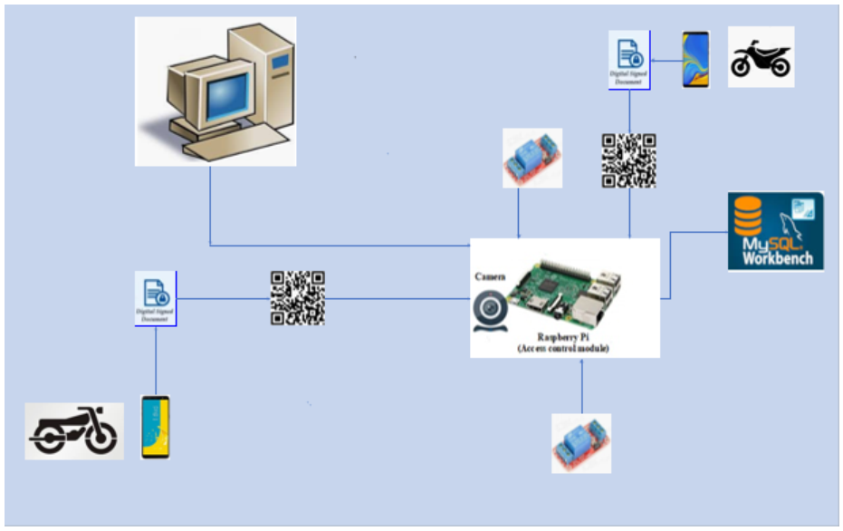
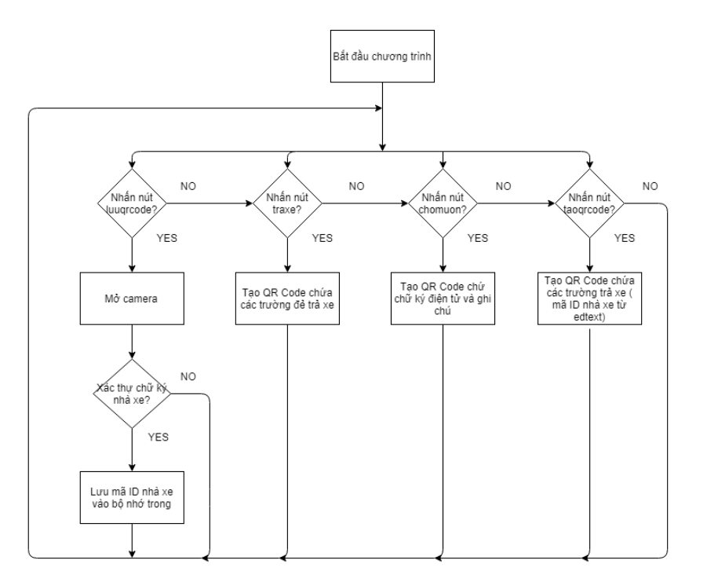
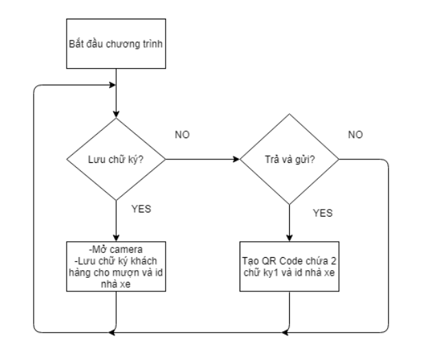
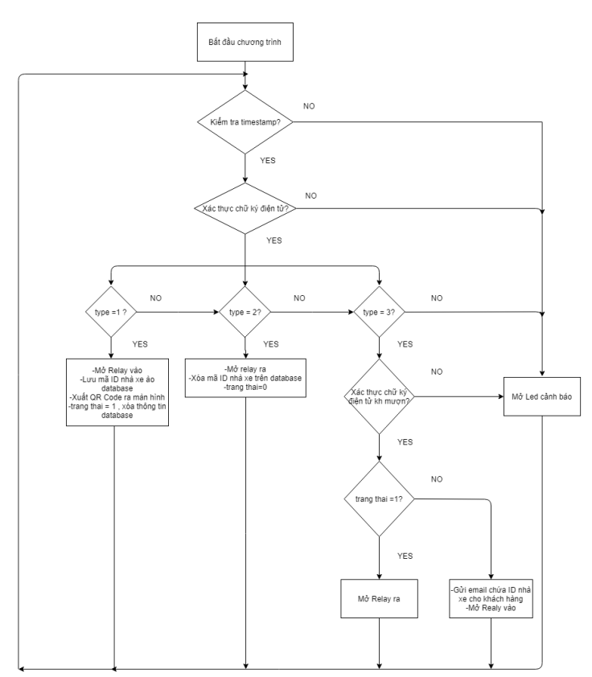
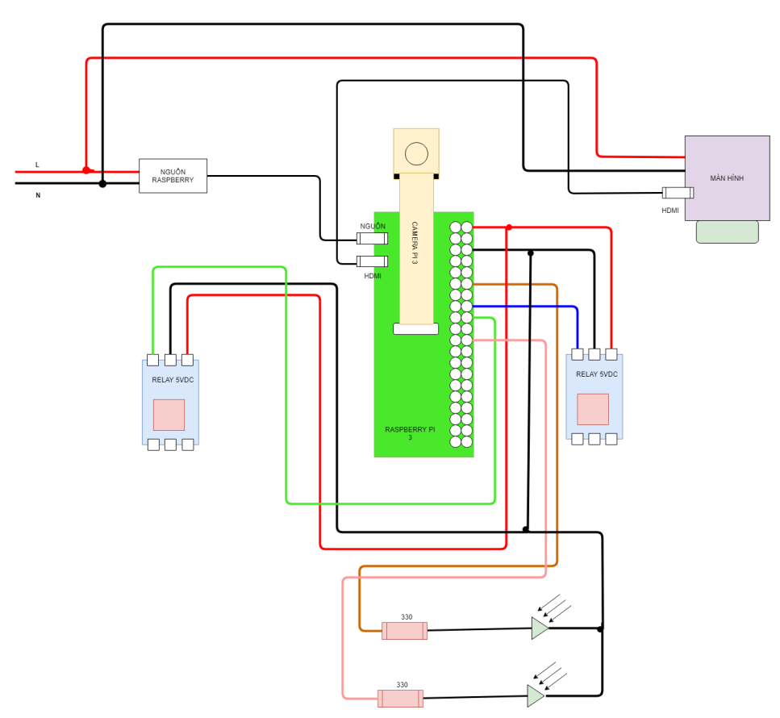
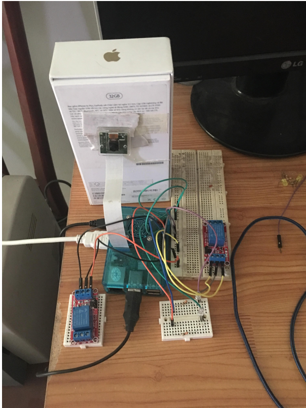
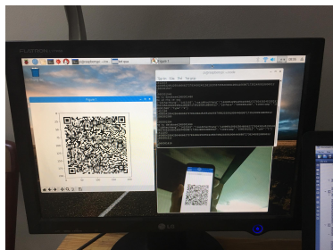
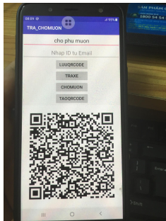

# Application of RSA Cryptosystem in Designing a Smart Parking System - Bachelor Thesis

## Introduction

 
This thesis proposes the system architecture of automated Parking ticket monitoring system. Customer uses mobile phone to generate input ticket (QR Code) to check-in, while the server (Rasberry Pi 4) validate the ticket from mobile phone 's users (QR Code) to decide the checking-out operation.

  

## Software Archicheture Design

  

  

  

## Hardware Architecture Design

  

## Results

- **System Evaluation.**

Figure: Experiments.

  

  

  

## Citation
	
`P. H. Long`
