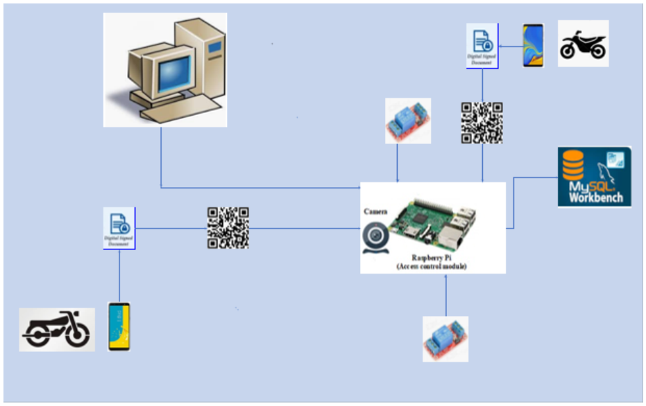
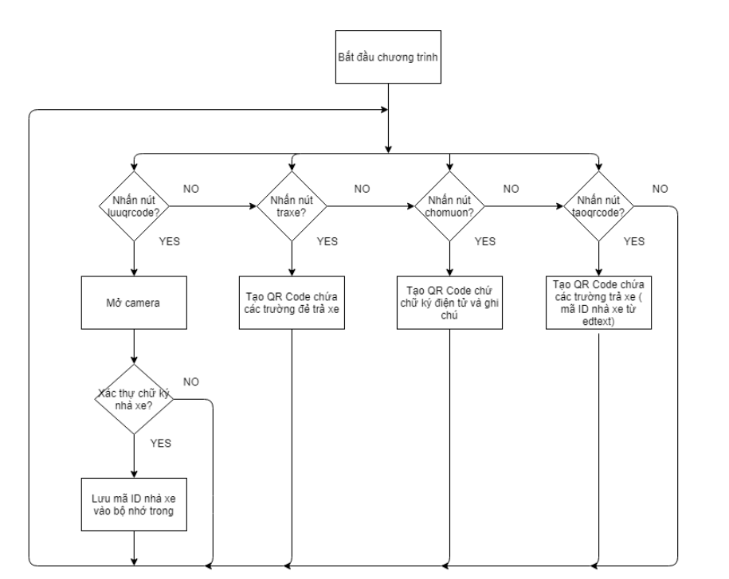
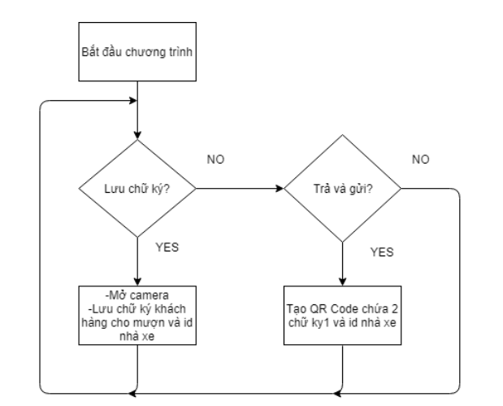
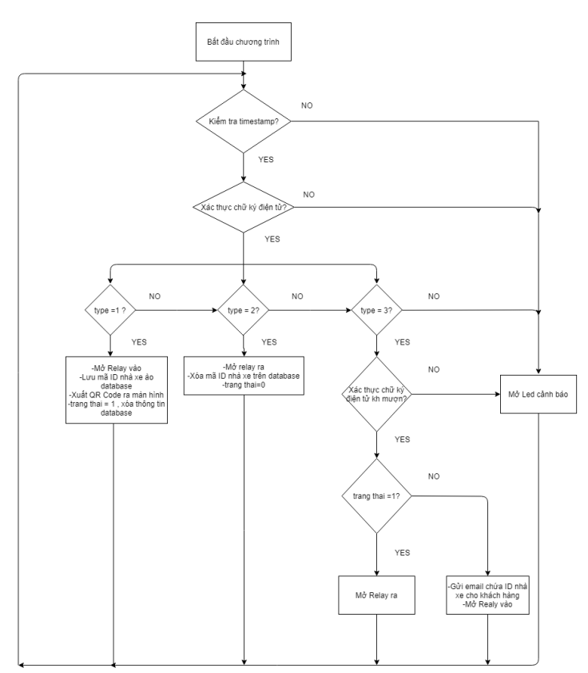
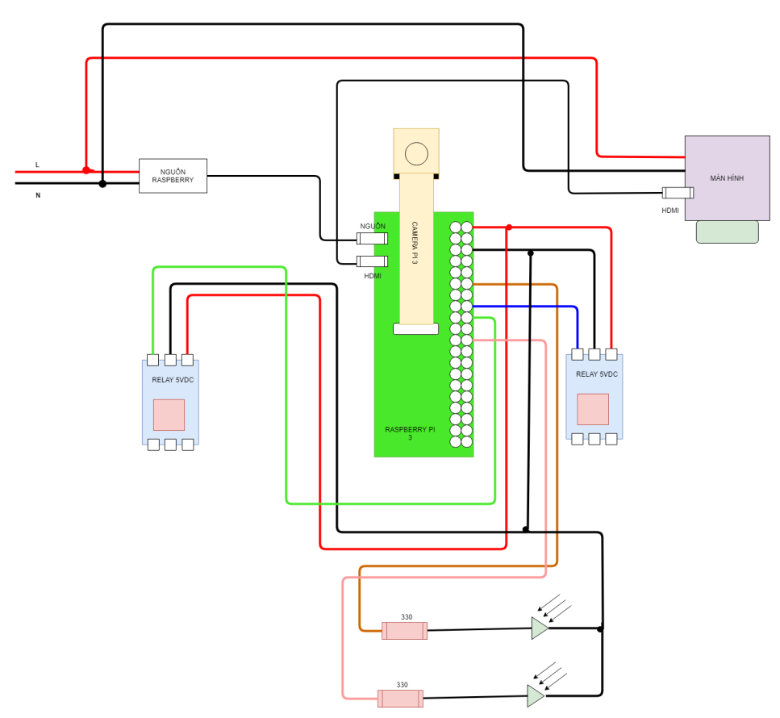
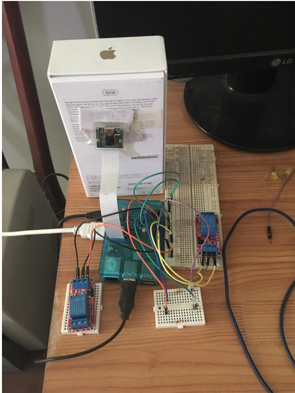
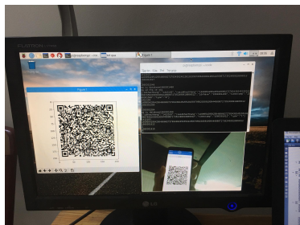
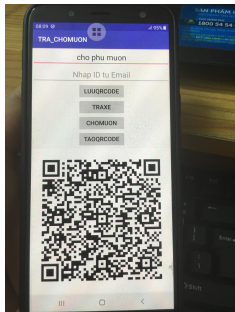

# Application of RSA Cryptosystem in Designing a Smart Parking System - Bachelor Thesis

## Introduction

 
The core of the system relies on RSA asymmetric encryption for robust security, chosen for its strong cryptographic properties, where breaking it with 1024-bit keys is computationally infeasible. This encryption is applied to implement electronic signatures. QR Codes are utilized for transmitting compressed electronic signatures and other information between the user's smartphone and the system, favored over barcodes due to their higher data capacity and superior error tolerance

The system's main components include

+A Raspberry Pi 3 embedded computer as the authentication unit, equipped with a camera to scan QR codes, control relays for gate access, and display information on an LCD screen.

+Smartphone applications (Android), specifically GUIXE (for parking), TRACHOMUON (for retrieving and authorizing lending), and MUONXE (for borrowing), which generate QR codes containing customer electronic signatures and decrypt system-generated QR codes.

+A CA Server (Certificate Authority Server) developed in Java (Netbeans) that manages the Public Key Infrastructure (PKI) based on the X.509 standard, responsible for generating, storing, and signing customer public and private keys

  

## Software Archicheture Design

  

  

  

## Hardware Architecture Design

  

## Results

- **System Evaluation.**

Figure: Experiments.

  

  

  

## Citation
	
`P. H. Long`
